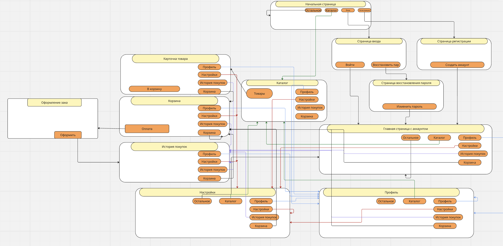

###1. Архитектура проекта  
##Диаграмма компонентов:  
#Схема графического описания взаимосвязей сущностей
  

#Описание каждого компонента:  
 - **Фронтенд**:  
 1. HTML5 (семантическая верстка)  
 2. CSS3 (чистый CSS без препроцессоров)  
 3. Vanilla JavaScript (ES6+)  
   
 - **Бэкенд**:  
 1. Язык: Python  
 2. Фреймворк: Django  

 - **База данных**: SQLite3  

#Структура:
```bash
src/
├── projectBody/         # Основное тело проекта
│
├── cart/                # Бэкенд (Корзина)
├── catalog/             # Бэкенд (Каталог)
├── firstpage/           # Бэкенд (Главной страницы)
│
├── mainApp/             # Главное приложение
│
├── media/               # Медиафайлы
│   ├── avatars/         # Аватарки
│   ├── catalog_photos/  # Фото товаров
├── orders/              # Бэкенд (Оформлении заказа)
├── personalAccount/     # Бэкенд (Личный кабинет)
│
├── static/              # Статические файлы
│   ├── css/             # Стили
│   ├── images/          # Изображения
│   └── js/              # JavaScript
│
├── templates/           # Шаблоны
│   ├── accounts/        # Аккаунты
│   ├── cart/            # Корзина
│   ├── catalog/         # Каталог
│   ├── orders/          # Заказы
│   ├── personalAccount/ # Личный кабинет
│   ├── users/           # Пользователи
│   ├── base.html        # Базовый шаблон
│   └── FirstPage.html   # Главная страница
│
├── tests/               # Тесты
├── users/               # Бэкенд (Создание или взаимосдействия пользователя)
│
├── db.sqlite3           # База данных
├── manage.py            # Django скрипт
├── Dockerfile           # Docker конфиг
├── Makefile             # Сборка
└── requirements.txt     # Зависимости
```

###2. Инструкции по развёртыванию  
1. **Запуск без использования Docker**  
    Необходимо перейти в директорию `src`, после написать  
    `make install_dep` - эта команда предназначена для установки зависимостей проекта,   
    `make run_launch` - эта команда запускает сервер локально, без использования докера.  
    В Makefile прописаны все необходимые команды для установки и запуска проекта

2. Запуск с использованием 'Docker'a  
    Необходимо перейти в директорию `src`, после написать  
    `make` - эта команда запускает:
    1. Контейнеризацию докера
    2. Тесты
    3. Сервера

###3. Руководство пользователя:
1. Введение:
    - Сайт предназначен для заказа или продажи небольших металлоконструкций и дальнейшей работы с клиентами.

2. Быстрый старт:
    1. Откройте [сайт приложения](http://127.0.0.1:8000/)  
    2. Введите логин/пароль 
    3. Нажмите "Каталог" в верхнем меню  
    4. Выберите подходящий вам товар  
    5. Добавьте в корзину  
    6. Оформите заказ

3. Основные функции (пользователь):
    1. Выбор товара (под свои размеры) из Каталога товаров  
    2. Добавление в корзину
    3. Взаимодействие с личными данными, фото к странице, изменение любых данных  

4. Основные функции (администратор):
    1. Добавление категории товара   
    2. Добавление товара в каталог  
    3. Изменение каточки товаров (при необходимости).    